# Amogh Garg — Portfolio

Personal portfolio website for **Amogh Garg**, Software Engineer at Microsoft.  
Landing page: [amoghgarg.com](https://amoghgarg.com) · Portfolio: [amoghgarg.com/portfolio](https://amoghgarg.com/portfolio)

---

## Repository Structure

```
Portfolio2/
├── index.html              # Root landing page (amoghgarg.com)
├── portfolio/              # Portfolio source files (amoghgarg.com/portfolio)
│   ├── index.html          # Main HTML page (all sections in one file)
│   ├── styles.css          # Global stylesheet (light/dark themes, responsive)
│   └── script.js           # Interactivity: theme toggle, scroll animations, contact form
├── tests/
│   └── landing-page.spec.js  # Playwright screenshot tests for the landing page
├── screenshots/            # Local test screenshots (see below)
├── package.json            # Dev dependencies (Playwright)
├── robots.txt              # SEO crawler directives
└── README.md
```

## Running Locally

The site is a plain static website — no build step or dependencies required for local development.

### Option 1 — Python (built-in, recommended)

#### Landing page (root)

```bash
python3 -m http.server 8080
```

Open [http://localhost:8080/](http://localhost:8080/) for the landing page.

#### Portfolio

```bash
# Serve from the portfolio/ subdirectory so all relative paths resolve correctly
python3 -m http.server 8080 --directory portfolio
```

Open [http://localhost:8080/](http://localhost:8080/) in your browser.

> **Note:** When deployed, the site lives at `/portfolio` (e.g. `amoghgarg.com/portfolio`).
> Running the dev server from inside the `portfolio/` directory (`--directory portfolio`) replicates
> that behavior — `index.html`, `styles.css`, and `script.js` are all served from the root of
> the dev server just as they would be from `/portfolio/` in production.

### Option 2 — Node.js (`npx serve`)

```bash
npx serve portfolio
```

Then open the URL printed in the terminal (usually [http://localhost:3000](http://localhost:3000)).

### Option 3 — VS Code Live Server

1. Open the repository folder in VS Code.
2. Right-click `portfolio/index.html` → **Open with Live Server**.

---

## Deploying to GitHub Pages with a Custom Domain

### 1 — Enable GitHub Pages in the repository settings

1. Go to your repository on GitHub → **Settings** → **Pages**.
2. Under **Source**, choose **GitHub Actions**.
3. The workflow at `.github/workflows/deploy.yml` (already committed) will build a `_site/` staging directory containing the root `index.html` and the `portfolio/` subdirectory, then publish it automatically on every push to `main`.

### 2 — Set the custom domain in GitHub

Still on **Settings → Pages**, enter `amoghgarg.com` in the **Custom domain** field and click **Save**.  
GitHub will create (or confirm) the `CNAME` file already present at `portfolio/CNAME`.  
Tick **Enforce HTTPS** once the DNS check turns green (can take up to 48 h).

### 3 — Configure DNS in GoDaddy

Log in to [GoDaddy Domains](https://dcc.godaddy.com) → **My Products** → **DNS** for `amoghgarg.com`.

**Delete any existing A / CNAME records for `@` and `www`**, then add:

| Type | Name | Value | TTL |
|------|------|-------|-----|
| A | `@` | `185.199.108.153` | 1 hour |
| A | `@` | `185.199.109.153` | 1 hour |
| A | `@` | `185.199.110.153` | 1 hour |
| A | `@` | `185.199.111.153` | 1 hour |
| CNAME | `www` | `amoghgarg20.github.io` | 1 hour |

> These are GitHub's official Pages IP addresses.  
> The `www` CNAME lets `www.amoghgarg.com` redirect to the apex domain automatically.

### 4 — Verify

After DNS propagates (usually < 1 hour, up to 48 h):

```
dig amoghgarg.com +noall +answer     # should show the four GitHub IPs
```

Then open `https://amoghgarg.com` — the landing page and portfolio will be live. 🎉

---

## Screenshots

### Landing page (`amoghgarg.com`)

| Preview | Viewport |
|---------|---------|
| 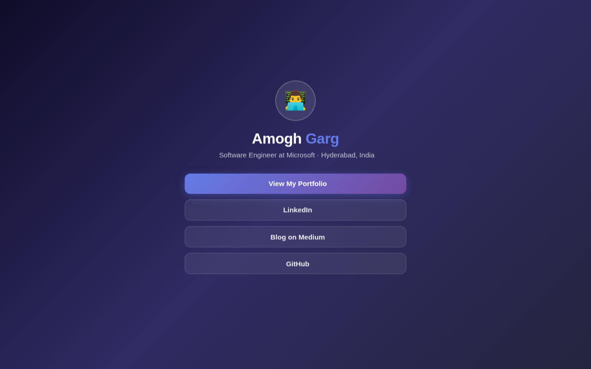 | Desktop (1280×800) |
| 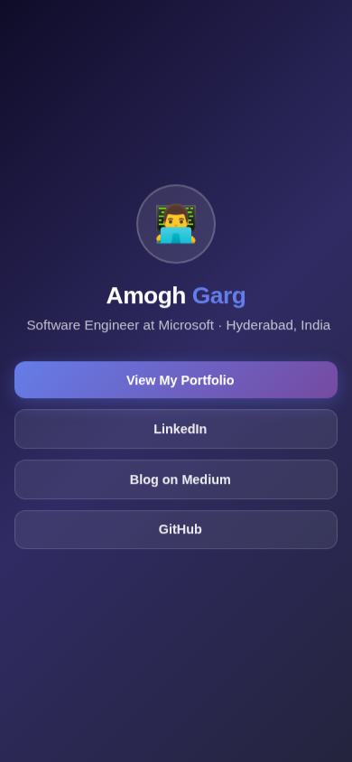 | Mobile (390×844) |

Run `npm install && npx playwright install chromium && npm test` to regenerate these screenshots.

### Portfolio (`amoghgarg.com/portfolio`)

Captured locally with Playwright against `python3 -m http.server 8080 --directory portfolio`.

| Preview | Section |
|---------|---------|
|  | Hero (light mode) |
| 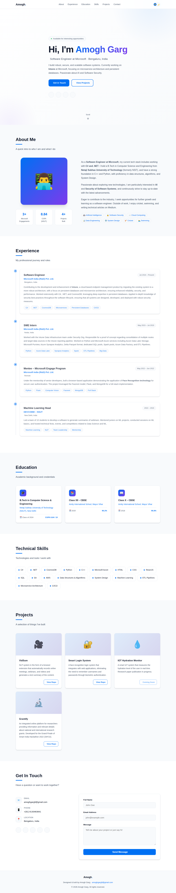 | Full page (light mode) |
| 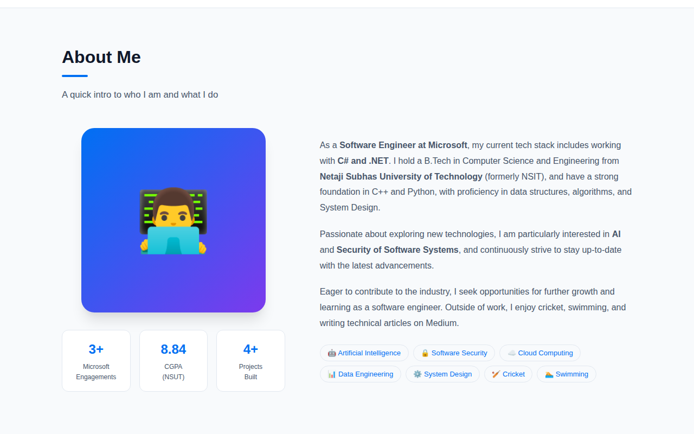 | About Me |
| 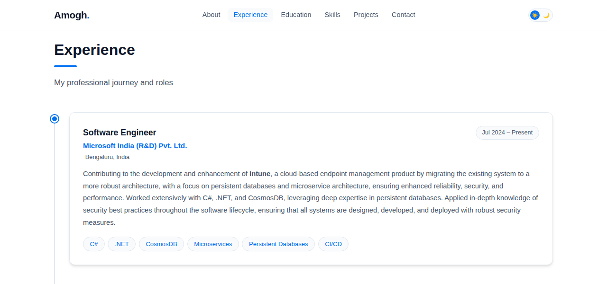 | Experience |
| 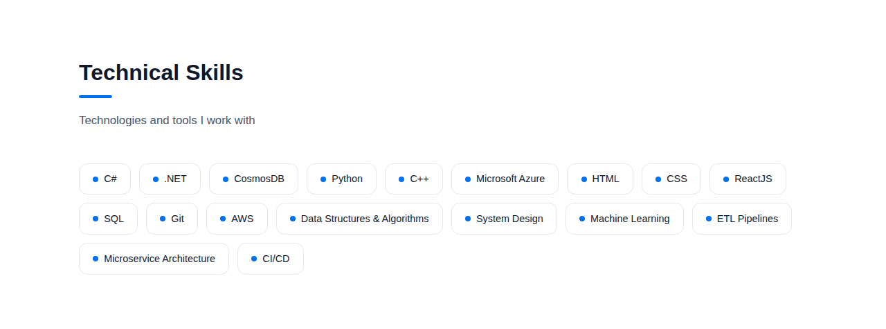 | Technical Skills |
| 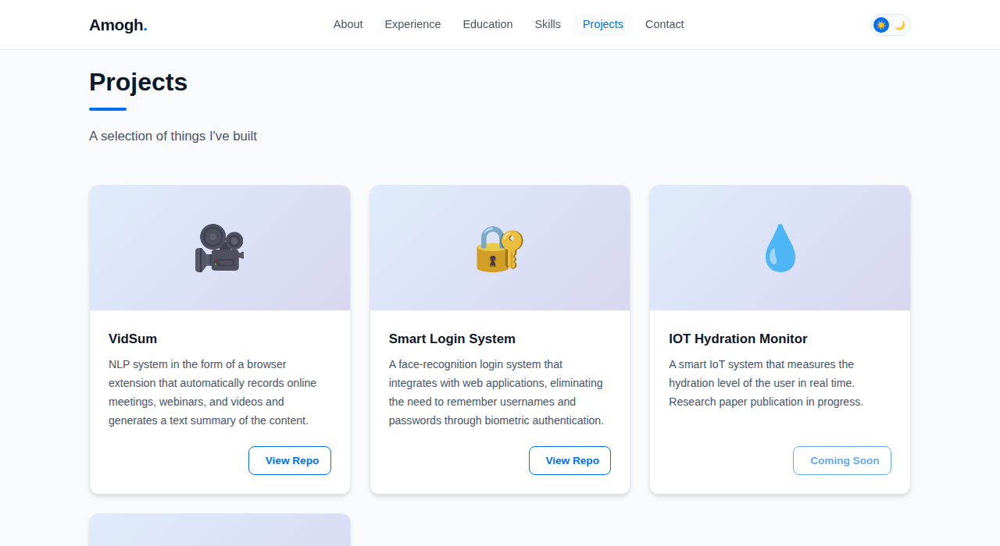 | Projects |
| 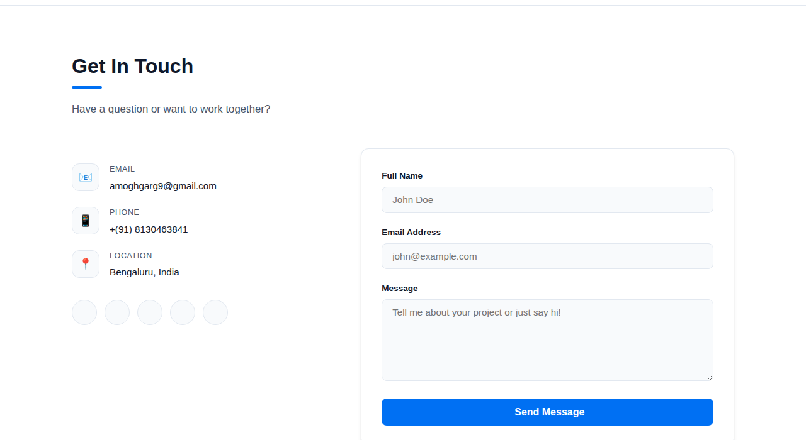 | Contact |
| 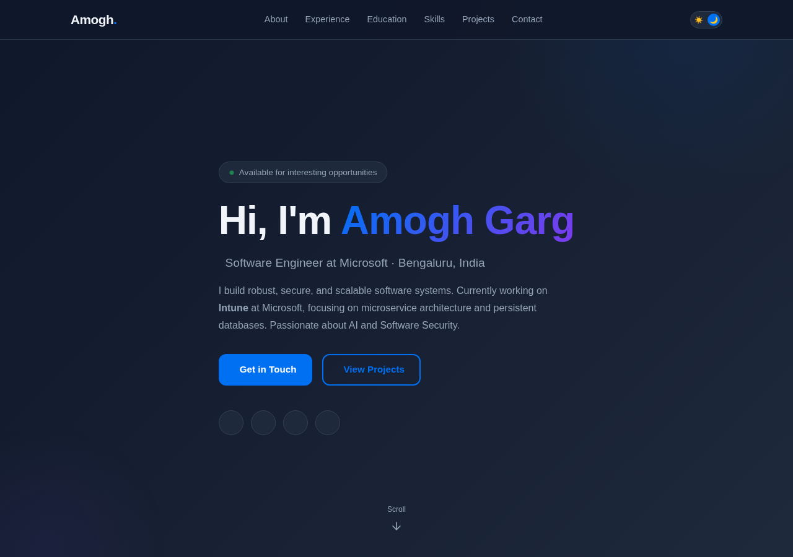 | Hero (dark mode) |
| 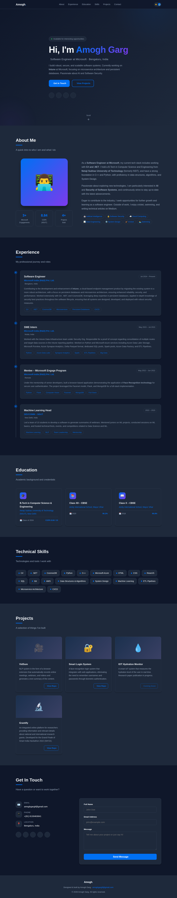 | Full page (dark mode) |
| 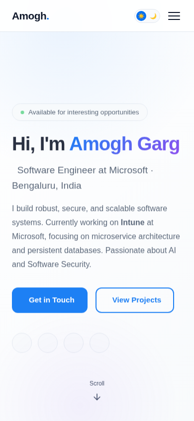 | Mobile viewport (390 × 844) |

> Social icons appear as empty circles in the screenshots above because Font Awesome's CDN is
> blocked in the capture environment. They display correctly in a real browser.

---

## Tech Stack

| Layer | Technology |
|-------|-----------|
| Markup | HTML5 (semantic, accessible) |
| Styles | CSS3 — custom properties, CSS Grid, Flexbox, `@keyframes` |
| Behavior | Vanilla JavaScript (ES6+) |
| Icons | Font Awesome 6 (CDN) |
| Fonts | Inter — Google Fonts |

## Features

- 🌗 **Light / Dark theme** toggle with `localStorage` persistence
- 📱 **Fully responsive** — mobile-first, hamburger menu on small screens
- ✨ **Scroll animations** via `IntersectionObserver`
- 📬 **Contact form** with [Formspree](https://formspree.io/) integration (server-side delivery, spam protection)
- ♿ ARIA labels and semantic HTML throughout

---

## 📬 Contact Form Setup

The "Get in Touch" contact form uses [Formspree](https://formspree.io/) to deliver messages directly to your inbox — no backend server required.

### Configuration

1. **Create a Formspree account** at [formspree.io](https://formspree.io/)
2. **Create a new form** and note your unique Form ID (e.g., `xAbCdEfG`)
3. **Update the form action** in `portfolio/index.html`:
   ```html
   <form ... action="https://formspree.io/f/YOUR_FORM_ID" ...>
   ```
   Replace `YOUR_FORM_ID` with your actual Formspree Form ID.

### Security Settings (Recommended)

- **Domain Restriction**: In your Formspree form settings, add your domain (e.g., `amoghgarg.com`) under *Authorized Domains* to prevent submissions from unauthorized origins.
- **reCAPTCHA**: Enable reCAPTCHA in the Formspree dashboard under *Spam Protection*.
- **Honeypot Field**: A hidden honeypot input (`_gotcha`) is already included in the form to catch spam bots.

### Notes

- Formspree's free tier allows up to **50 submissions per month**.
- No API keys or secrets are exposed in the client-side code.
- Submissions are processed entirely server-side by Formspree.
